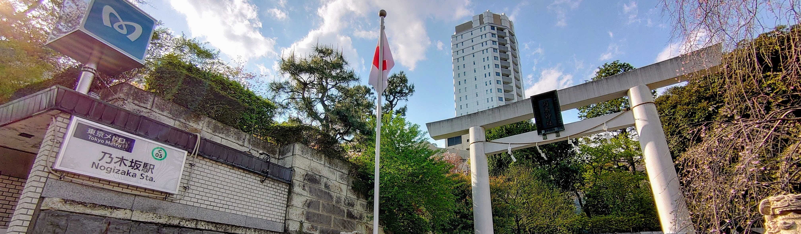

ITベンチャーでデザイナー兼エンジニアとして経験を積んだ後、フリーランスとして独立。主に広告・映像・ウェブなど幅広い領域で商業作品に携わる。担当したクライアントにはミスユニバース ジャパンなど。並行して教育系NPOに移り、事業開発、経営企画を担当。主にキャリア教育事業を担当し、事業業績の立て直しに奔走。着任からおおよそ1年で事業単体のV字回復を果たした。同社では外資系企業、上場企業や官公庁とのアライアンスも担当。2018年より、当時資金調達前だったスタートアップに参画。組織文化・体制の整備から、バックオフィス部門の構築、事業開発を行う。2020年5月に同僚のエンジニアと共にatenaを企画、開発、リリース。現在はatenaを運営する会社を設立し、株式会社N-Technologies 代表取締役。
