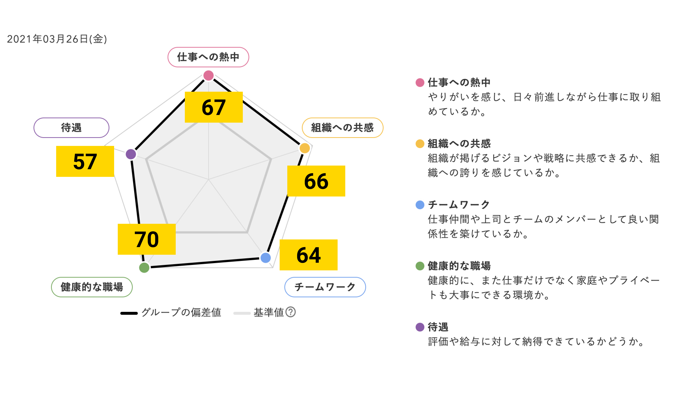

N Inc. の白髭です。N では atena という会社に届く郵便物を電子化して、全社的に "新しい働き方" の実現を目指すサービスを提供しています。

そんな弊社は2020年6月の創業からそろそろ1年を迎えようとしており、私たちに関わってくださるスタッフの方も増えてきました。そこで、アトラエ社が提供している「wevox」というエンゲージメントツールを導入して、組織状態の可視化に取り組んでみました。

## 何故可視化に取り組んだのか

前職(スタートアップのCOO)時代、数名の時にジョインをしてから数ヶ月で10数名採用して組織のカルチャーフィットに悩んだ経験があります。その時は色々迷走して本や note を読みまくったり、コンサル会社に話を聞きにいったりしていたのですが、最終的に役に立ったのは「wevox」でした。現在のウィークポイントとストロングポイントを可視化できたことで、結果として何を改善していくのが良いのか？その亀裂の原因を探すことができました。そういう経験もあり、早いうちから可視化をしたいという想いがありました。

また、前のブログにも書いたような働き方を実現しようとする上で、果たして現状それがフィットしているのか？改善の余地はないのか？ということを細かくトラッキングしていくことが重要なポイントであると考えました。

[自由に休める会社をつくる](/create-a-stressfree-company-culture)

## 自社のエンゲージメントを公開する理由

いくつか理由があるのですが、ざっくりとまとめると以下のような感じです。

### ① 会社の現状を候補者の人に知ってもらうこと

N では、採用におけるカルチャーミスマッチやスキルミスマッチを最大限減したいと思っています。これらは私たちが掲げる "Being happy is the most important (精神的肉体的に常に健康であること)" に反すると考えているからです。そのため、業務委託での体験入社を積極的に勧めているほか、初回のカジュアル面談から会社のありのままを伝えるように心掛けています。(実際初回のカジュアルで売上高とかありのままに伝えています)

その中で最も伝えづらいと思っているのが「組織の状態」です。どういう人が、どう働いていて、どこに組織の課題があるのか、これを伝えるのは難しいですが、evoxによって一定容易に行うことができます。

### ② 社内の改善に繋げること**

WHYにも書いた通りこれをやるために導入したようなものですが、社内において「組織」の改善サイクルを回すのにスコアという数字があることは非常にそれを容易にします。効果のある施策を的確に実施していくためには非常に強いサポート要素です。

## 実際にスコアをみてもらおう

note執筆現在の実際のスコアを公開します。

みやすいようにちょっとだけ加工しましたが、スクリーンショットそのままです。上が絶対値（スコア）で、下が wevox のベンチマークとの差です。

全てのスコアでベンチマーク以上、という結果になりました。ありがたや。

バランス分析でも、非常に高い値になりました。（比較対象は、全業種・全規模）

## 私たちが強みだと思っていること

ここからは細かくみていきます。まずは私たちの組織が強みとしていることです。

### 経営理念

理念戦略。2点目の戦略の部分はMVPレベルのサービスもあるので一定許容かなと思いつつ、全体的に非常に高い状況になりました。

ちなみにこれ↓は声を大にして自慢したい。ありがとうみんな。

### 自己成長

両方ともベンチマークから +22 / +16 という感じです。この辺りはスキルミスマッチしていない事例かなと思っています。

### 組織風土

組織風土も全体的に高いスコアになっています。とりわけキャリア機会、称賛が強いですね。リモートワークでやっていると抜け落ちがちな項目です。

### 健康

そして！！健康！！非常に大事ですね。

前職も含めて、お手伝いしていた先でリモートワークを導入した直後のエンゲージメントスコアが悲惨な状況になったのを思い出しますが（ストッパーが効かないので働きすぎてしまう、自分の時間がなくなるなどの結果）、今回のスコアは非常に高く出て安心しました。

仕事量はベンチマーク比 +24、ストレス反応は +17です。

リモートワークに慣れた人材を採用しているからか、うまくセルフマネージメントできる人たちのようです。

## 私たちが課題と思う点

もちろん課題もあります。例えば、給与や評価への納得感です。このフェーズのスタートアップにありがちな適切な評価がなされないのでは感（評価基準がないのでブレがある）や、給与の問題です。

資金調達のフェーズにつれてこの部分もしっかり取り組んでいかないといけないなと感じています。少なくとも給与水準はSOなどを活用したり、少しずつでもベースアップするなどの取り組みを行うべきと思っています。

## とはいえ

とはいえ、まだまだ改善の余地ありですので、スコア100の優等生を目指して改善を重ねていきたいと思います。お力添えをいただける人事の方も探しております🙇‍♂️

## 全てのスコアはカジュアル面談で赤裸々に話します

勿体ぶるわけではないのですが、全てのスコアがまあまあ高いので説明しきれません！ということでカジュアル面談で、スコアや売上などのKPIなども含めて赤裸々に会社の状況をお話ししますのでぜひご連絡お待ちしております！

特にデザイナー職、セールス職は強く探しております。人事・広報や、エンジニアさんやそのほかのポジションについても引き続き探しておりますのでお気軽に🙏
