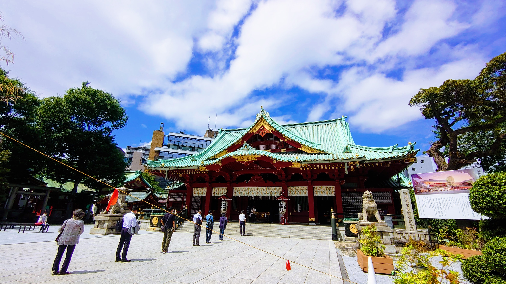
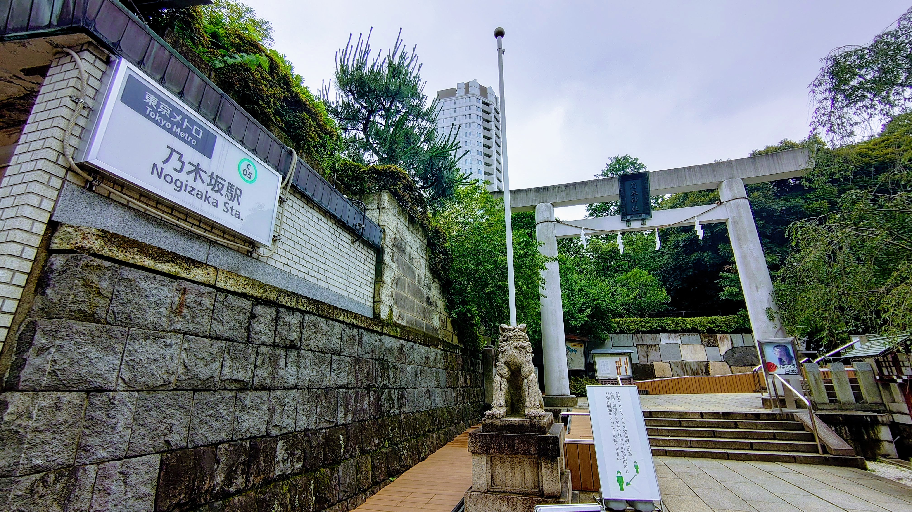

超絶スピリチュアルな話ですよね。わかります。

元々は、どちらかといえば無神論者で、お守りも買うけれどそれは儀式的なものだと思っていました。

でも最近は、神様はいると思っています。神頼みもあると思っています。

### 2015年のお話

この業界に足を踏み入れたのはかれこれ5年以上も前ですが、どっぷりと使っていく数ヶ月前だったと思いますが、はじめてこのときに神田明神にお参りしました。
ちょうどフリーランスとしてのお仕事を始めたタイミング、2015年の年の瀬、12月下旬だったと思います。

あまり覚えていないのですが、仕事が各方上手くいきます様に、と御願いした気がします。

その後、色々なお仕事をいただく様になり、今の自分のきっかけとなる繋がりも多くあります。
これが最初の、転機になったかもしれないきっかけです。

ちなみに、2015年から欠かさず、年末と年始には神田明神へお礼参りと初詣をすることにしています。

### 2020年のお話

そんなこんなで、神田明神には決まってお参りするようになっていた私ですが、少し時間を飛ばして2020年のお話をします。

数ヶ月前ですが、本当にプライベートも仕事も完全に疲弊しきっていた時期がございまして。
あまり詳しく話せないのですが、すること為すこと、全てが下向きに動いていて、もう何もしたくない（しない方がいい）というようなマインドでした。

本当に精神的にも来ていましたね…。

 

そのような状況のある日、確か携帯を失くしたんですね。電車に置き忘れだったと思うのですが。
どこを探しても全くなくて、確か同じタイミングでトラブルが何件か併発して、さらに精神的にやられていた覚えがあります。

 

それで、何を思ったのか（全く記憶にないのですが）赤坂にある乃木神社の鳥居をくぐったんですね。
多分、乃木坂の近くにある神社、というくらいの感覚だった気もするんですが。

 

普通にお参りして、おみくじを引いたら、44番（この時点で不穏）、開けたら大凶（凶だったかな）でした。

 

精神がいつも以上に擦り減っているところで、凶が来たもので、このまま帰ったら事故に遭って死にそうと思うくらいでした。
本当にスピリチュアル極まりないですが、本当に身の危険を感じました。
精神がすり減った状態で立て続けに色々起きると結構くるものがあります。

 

乃木神社は17時までで、ちょうど16時五十何分とかだったので、社務所の方に明日御祓はできますかと聞いたところ、今でも良いと仰ってくださりまして、その流れで厄除をしていただくことになりました。

 

そこから翌日、翌々日と精神がおさまるまで、多分1週間、2週間くらいですかね、毎日お参りに行っていました。

### 最近のお話

それからというもの、いまだに信じられないのですが、本当に下向きになっていたことが全て上向きになって、毎日楽しくやらせていただいています。

こういうことがあり、何か大事なことがあったり、願掛けするときは決まって神田明神と乃木神社にお参りするようになりました。
今では神様はいると思っていますし、運命もあるのかなと思っていたりします。

常日頃、全てにおいて誠実に生きたいと思うこの頃です。そういうお話でした。

 

P.S. 昨日、1ヶ月ほど進めていた大きな案件がクローズしまして、昨日今日でそれぞれお参りに行ってきました。いつも皆さま、ありがとうございます。

