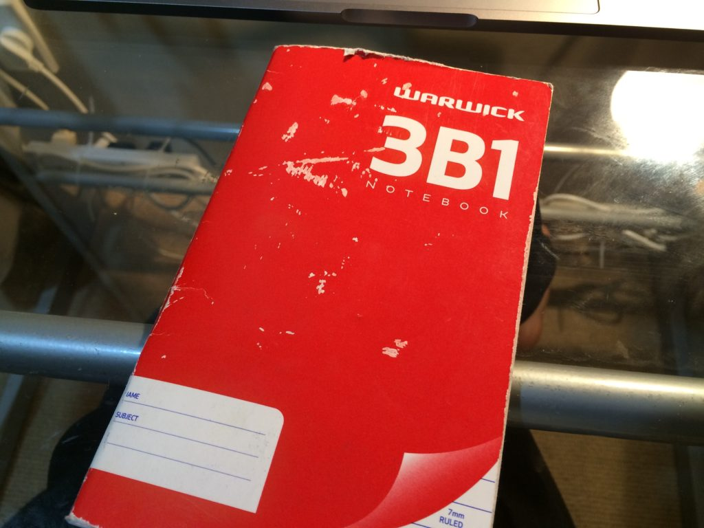

そんなこんなで明日から(僕の学校は)４連休に入るのですが。

 

ちょうど今日でProgress Test(理解力テスト)が終わりました。

 

僕は入学時のテストで恥ずかしながら「英語力が足りない」と判断されて、ファウンデーションコース(準備コース)というクラスに入っています。

カナダなどではおそらく英語力が足りないと判断された時点で語学学校に送り返しされそうな勢いですが、ニュージーランドは比較的寛容でESOL(英語以外を母国語とする人のための英語)が幅広く整備されています。

 

さて、5月1日に入学してから今日でちょうど1ヶ月の6月1日ですが、僕は無事本科に行く権利を得ることができました。

正確には1週間前に呼び出されて本科行きが通告されていたので、2週間でファウンデーション抜けができた、ということになります。

ちなみに僕よりも1週間遅く入ってきた人も同じく今日本科行きが決まったので、両者2週間で抜けたと言っていいでしょう。

 

そもそもファウンデーションコース、とは本科を受けたところで英語力が足りずついていけないだろうと判断された人が、最低限の英語力をつけることが目的のクラスです。大半アジア人が集います。中国人、日本人が多いイメージです。

 

これから留学する人のために、僕が何をしたのかを記しておきたいと思います。

## Table of Content

* ①まずは基本から。
* ②課題はやりすぎて構わない
* ③最初の1〜2週間、単語帳は怠らない
* ④進級テストはナメてはいけない
* 最後に。

## ①まずは基本から。

ファウンデーションコースに入って授業を受けると、ちゃんと日本の学校に通っていた人は、驚きが隠せないと思います。

**簡単すぎるのですから**

 

とはいえ、**自分がそこにいる以上は、その程度のミスを入学時にしていた**、ということなのかもしれません。

その心構えが重要です。

これはいい機会と捉えて全てを全うして行くべきです。

 

もしかするとこの環境に置かれたら、あなたは

「なんだこんな簡単なもの、やってられるかよ」

みたいに思ってしまうかもしれません。

 

それは言語道断です。

 

一つずつ目の前のことをこなすことが早く本科に行くコツと言えるでしょう。

 

**課題に真摯に取り組み、授業をしっかり受け、「最低限」の基礎をまずはしっかり改めること。**

## ②課題はやりすぎて構わない

授業内で出た課題は、それだけやればいいものですが、それ以上やっても怒られることはありませんよね。

求められていないものはやらなくていいことは正論ですが、暇なファウンデーションコースにいる以上、ハードな課題が出ません。僕は何もすることがないのが本当に嫌だったので、一つの課題に1時間くらいかけてこなしていきました。

記述課題が多いのですが、これは言いたいことを**まとめていく力**にもなりますし、**単語力、文法力**につながります。

少しの積み重ねこそが成果を生むと言えると思います。

僕の場合は一行の一問一答でも答えられる課題に対して、「なぜ」「どのように」と言った内容を加えていました。

暇を極めて、SNSやYouTubeを見ているようなら、課題を**"やりすぎる"**べきです。

## ③最初の1〜2週間、単語帳は怠らない

こんなことを聞いたことがあるのではないでしょうか？

**「授業でわからない単語があったら全部メモしておけ。」**

これは本当に正論だと思います。

 

僕はこういうのが好きなタイプではないですし、むしろ大っ嫌いな方ですが、最初の１、２週間毎日欠かさず行いました。

 

小さなノートを買って、ひたすらメモしていきます。

見ると「ああこんな単語を」なんて思いますが、それは成長の証として放っておきます。

大半の人は、その場で辞書で調べて「あー」って思って終わるでしょう。

でもそれだけじゃ身につかないところか、忘れます。ほぼ。

 

なので僕は追加で、家に帰ってからノートに単語と意味をまとめます。

簡単な作業ですが、案外反復練習になります。

少し忘れかけた頃にもう一回調べて書くので。

 

だいたい2週間も経つと、**あ、この単語は重要だ**、みたいに理解できるようになってきます。

そうなれば、ある程度効率化できます。ノートに記さなくても、意味と文を組み合わせて覚えたり、ということをすぐに出来るようになります。

僕も今ではノートに記さない日も増えてきました。

 

とりあえずそうなるまでの１、２週間は欠かさずやりましょう。

## ④進級テストはナメてはいけない

いくら簡単な授業とはいえ、進級テストはナメてはいけません。

常に最善の準備をして臨むべきです。

それは試験をしてくれる人への敬意でもあります。

僕も今回の試験前に本科行きの知らせは受けていましたが、最善を尽くして臨みました。

 

今回は、Reading Writing Listening Speakingの４技能に加えて、Vocabulary, Grammarの、５科の試験がありました。

 

一例ですが、Speakingの時に自分がやった準備を置いておきます。

試験内容は日常会話＋5つの課題から選んでその話題でスピーチした後に短い一問一答、でした。

運よく5つの課題は事前に発表されたので、以下の準備をしました。

 

* よくあるスピーキング試験で出そうな内容を頭に入れておく
(これだけで、焦らずにすみます)

* 5つの課題に対して何を話すか、その構成を日本語でまとめる。

 

いきなりこれについて話せって言われても、文章構成バラバラになってしまいませんか？

日本語でそうなるんだったら、英語はなおさらですよね。

そこで、まず日本語でどんなことを話すか、ポイントだけまとめました。

どんなことを話そうか、頭で軽くイメージして行くと、「これなんて言うんだろう」と言うのが必ずたくさん出てきます。

それを事前に潰しておくのです。

 

例えば、5つの課題のうちの1つで地震の話をしようと思っていたのですが、

「earthquake」という単語は知っていましたが、読み方がわかりませんでした。

事前にこれを潰しておけたことで、スムーズに話をすることができました。

 

パッとこんなこと、というのだけまとめておくだけで、プレゼンもスピーチもやりやすいですよ！

僕は今回だけじゃなくて、プレゼンでも取材の時でも同じやり方をしています。

 

たまにいるのは、話すスピーチを全部英訳して暗記しようとするパターン。

一つの課題と決まって入ればまだしも、5つとかになると無理がありますよね。

しかも提示されたの前日だし。

 

全文覚えるデメリットがあります。

* １）もし一文忘れたら焦って全部飛んでしまう可能性がある
* ２）アドリブに対応できなくなる

だからこそ僕はポイントだけまとめて、イメージしておくことで、機転を利かせたことができるようにしています。

 

今回の場合も、スピーチ前の日常会話のところで出た話を少し踏まえて話をしました。

そうすると準備してない感を出しつつ、冷静に対応していけます。

 

ざっと同じようなことを全ての試験でやりました。試験を「前読みして」行くのです。

これはみなさんやっていませんでしたか？

先生ごとに傾向があるからそこを掴んでいく、この先生が出題するターンだから、単語が多めだな、とか。

 

限りある時間ですから、効率的に進めて行くべきです。

そうすると効率よく進めて自習や娯楽に時間を使うことができます。

## 最後に。

全てはこれをしたら、どうなるかと言うことを前読みしてやっていきます。

課題をしっかり出している場合と、ナメてかかっている場合、先生はどちらを早く本科に行かせたいと思うでしょうか。

 

先生も人間ですし、むしろ海外、ニュージーランドは「尊敬」を大事にする国です。

敬語はなかれど、尊敬は常に大切にされていることです。

 

少し自らの勉強だけでなく、そう言うところに目を向けると色々な答えが出てくるかもしれませんね。

 

最も、ファウンデーションに入らないように日本に英語力を高めておくべきですが。

これは教訓で、語り継ぎたいと思います。

 

では。良い週末を、と言おうと思ったらまだ木曜日でした。
