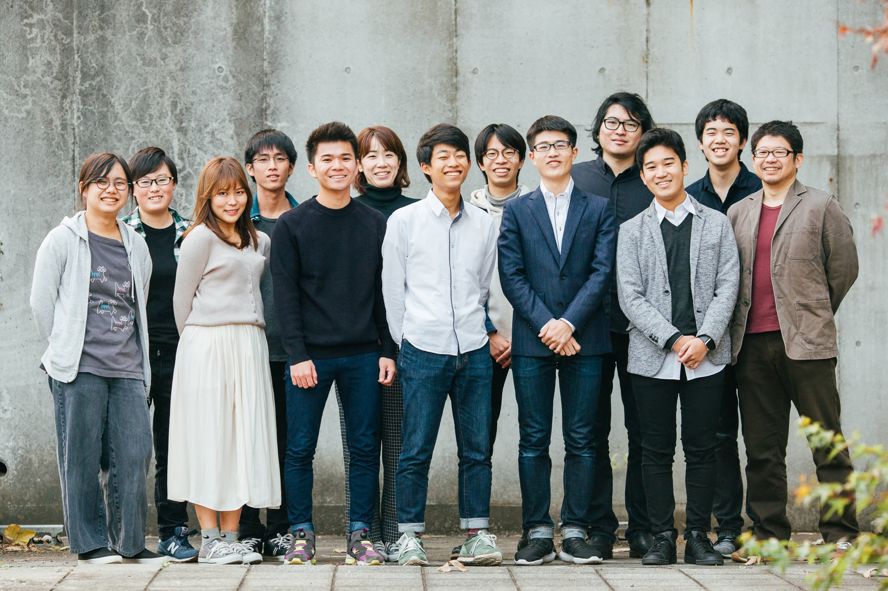
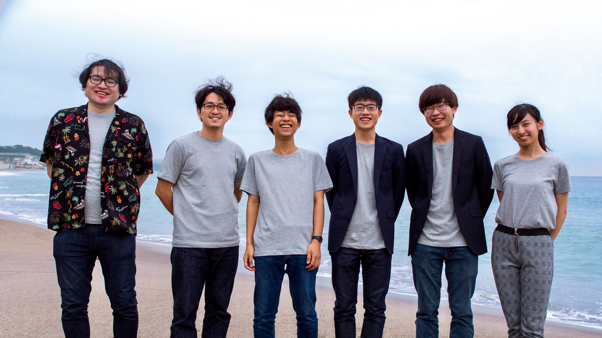
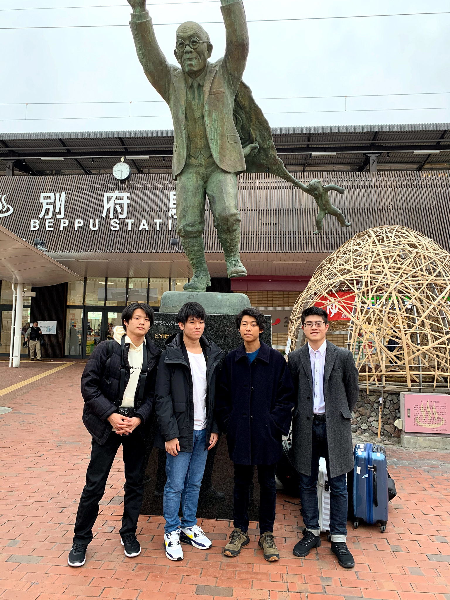
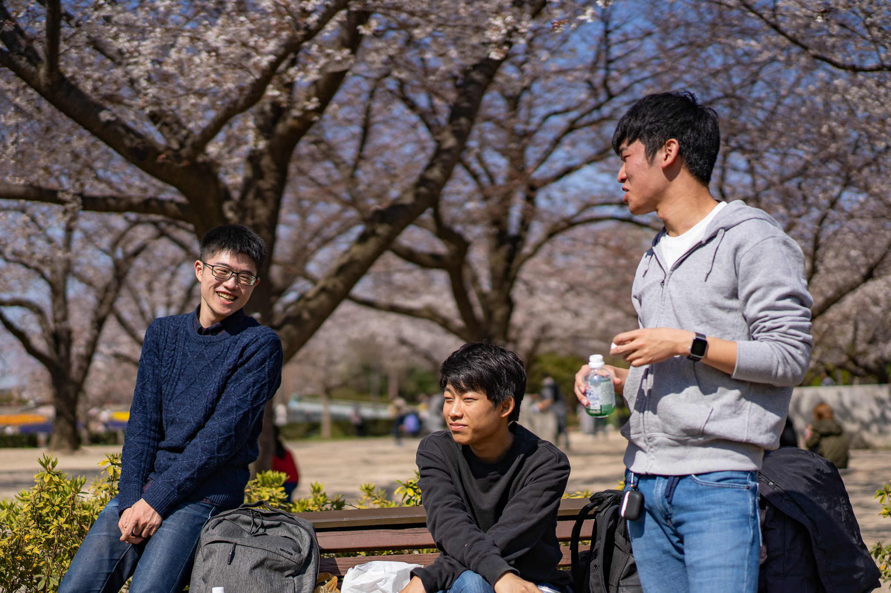

2018年5月にYoki社にジョインしてから早いもので2年2ヶ月、新しい道を歩み始める決断をしました。

本日付で、株式会社Yokiの取締役を退任しました。

 

スタートアップの退社の割合は多い一方、抱えるものは非常に大きい、人生の節目だと思っています。たかが2年ですが、本当に数年数十年、時を過ごしたように思えてなりません。

少しばかりですが、私の黄昏にお付き合いいただければ幸甚です。

## ジョイン

2018年5月、まだ私が前職に在職していた頃、確か共通の友人に紹介されて東出さん（以下、社長）と話しました。
ニュージーランドには時差があるのですがそんなことお構いなしに深夜2時とか3時に眠くなりながら会社のビジョンを（布団の中で）聞いていたことを覚えています。

これまでにスタートアップにはライトに関わっていたことがありましたが、ディープに関わったことはありませんでした。
スタートアップのピッチ芸なぞ知る由もない私は、聞く話聞く話なんだか身も蓋もないけど、単純に「面白そう」という理由でジョインしました。

## カオス

ジョインしてからというもの、一言で表現できますが「カオス」でした。

チャットツールはない、情報は錯綜、ワード？Google Docs？、ミーティングには自転車で参加する人がいて、とりあえずカオスでした。

 

最初の仕事は、このカオスで混沌としたところから必要な事項を抜き取り、プロダクトの仕様を作成することでした。
今でも信じられませんが数日で仕様書を上げ切った達成感を謎に体が覚えています。

そこからというもの、社内の開発体制の整備や、いわゆる普通に戻す作業に取り掛かることになりました。

 

当時の前職でも同じ頃数年担当していた事業が一区切りし、色々な葛藤があった中で、関係性を整理し、9月から正式にYoki社にジョインすることになりました。

## オペレーション

実は前職でも最初は同じような仕事をしていまして（ここまでカオスではありませんでしたが。）ナレッジの整理や業務フローの整理などを行っていました。
ということもあり少し慣れていたこともあったので、集中して1、2ヶ月その業務に取り掛かることにしまして、1から10まで働き詰めだったのを覚えています。

勤務時間を見て見ぬふりをしながら、社内システムの整理（必要なものはRailsで作ったりもしていました；；）から必要ツールの導入、意識づくり等々・・・。違った意味でカオスで濃密で楽しい時間でした。

 

改めて楽しかったなぁ。

 

はてさて、そこからというもの前プロダクトに向けて全力投球をしながら進んでいました。

皆さんお忘れかもしれないですが、弊社、元々ロボットを作っていまして、ニュージーランドから日本のロボットを動かせたときは最高に感動しました。

## ピボット

さて、ここで来ましたスタートアップの醍醐味（？）ピボットです。

 

ある日の深夜、作っていたロボットのデザイン賞の申請書を事務局に送ろうとしていたところ、社長から一本の電話がありピボットが決まりました。

詳細は割愛しますが、ロボットの開発等々の方針転換が決まり、いちから事業の作り直しに奔走することになりました。

平日数日潰して数時間、数十時間、Zoomを繋いでブレストをしていました。そこから始まったのが今、Yoki社が提供している「LOGY」です。

 

ここからは本当に大変な道のりでした。これまで数年とかけてきたプロダクトを方針転換することになった社長はもっと大変だったと思います。

どうやって展開するのか、マーケットはあるのか・・・etc 本当にゼロベースからのスタートでした。

これまで共に歩んできてくれた皆んなにも別れを告げたりしながら、今考えても本当に辛い日々でした。（辛いのは皆さん同じですから、私だけではないのですが。）

## 苦渋とスリム化

リリースを出したり、外部のパートナーと連携をしたりと色々な手を尽くしましたが、これといったものは見えて来ず真っ暗なトンネルを走り続けるような毎日でした。

その中でバーンレートを落とすために組織のスリム化をしたり、様々な投資家の皆様からの支えもあって今に至ります。

かれこれ色々な方法を模索しトライアンドエラーを繰り返しながら、1年という時間が過ぎていきました。

 

冒頭にも少し書きましたが、スタートアップの役員というのは、抱えるものは非常に大きいものです。

自慢と言えることではないですが、ここ1年は一切役員報酬を受け取っていませんでした。

1年前にあった貯金は桁がみるみるうちに減っていきました。

 

それでも、コミットメントを続けられたのは「面白かった」に尽きると思います。

 

辛くても、自身を犠牲にしても、面白いから頑張れる。
責任の重圧に押しつぶされそうになっても、仲間がいるから頑張れる。

 

本当に恵まれた仲間に囲まれた環境でした。

## オンライン学習の波

これはやはり書こうか迷うセンシティブなお話しです。

まず、今回のCOVID-19と闘うために全力を尽くしてくださっている医療関係者の皆様に心から御礼を申し上げます。
そして私たちの生活インフラを支えてくださっている全ての皆様、本当にありがとうございます。
そして辛い思いをされている罹患者の皆様、亡くなられた方、ご家族の皆様にお悔やみ申し上げます。

 

2月から爆発的に増えてきたCOVID-19によって、かつてないほどの自宅待機・在宅勤務の状況に変わり果てました。

この中で、注目されたのが「在宅サービス」です。UberEats、出前館といった出前系のものもあれば、私たちのようなオンライン学習というものもあります。

 

私たちとして何かできないか、緊急事態宣言が出された直後、無料で子どもたちにプログラミングを届ける活動を始めました。

最初は数名、多くて数十名の子どもたちを笑顔にできればと思って始まったものでしたが、最終的には1000人に及ぶ人数の方からご応募をいただきました。

 

本当にセンシティブな話ですが、そこから弊社のサービスをご利用いただく方も増え、無料期間プログラムが終わっても継続してくださる方がいらっしゃいました。

そこからはサービスの多角化という部分で、弊社のメンバーが中心となって LOGY for English（英語学習サービス）を提供したりと、エンジンの点火に尽力してくれました。おかげさまで、事業としては上向きな方向で進みつつあります。

## 決断

私はLOGY for Englishの立ち上げにはほとんど関わっていませんでした。

イチから事業を作り上げて、それぞれが立案し、動いて、作り上げているところを見ていると、自分があとできる事はないのではないか…と思うことが多くなりました。（ポジティブな意味です！）

 

実はこれまで辞めたいと思ったことは何度も数え切れないほどあります。

親しい友人にはいつもこの話をして話を聞いてもらっていました。

方針が変わったとき。色々と彷徨っていたとき。色々と考えるとこは多くありました。

 

それでも今までコミットメントを続けて来られたのは、一緒に同じ方向を向いて闘ってくれていた仲間がいたからだと思っています。

 

しかし、今回は、これまでと違ってポジティブなもので、自分自身としても新しい挑戦をしてみたいと思えたものでした。

辛さから逃げるのではなく、前向きな理由でそう思えたのなら、相談してみても赦されるかもしれない。そんな思いで、社長と話をしました。

もう3ヶ月近くも前の話ですが、そこから、これまで支えてくださった投資家の皆さまにもお話をさせていただき、今日を迎えました。

この2年と少しの間、本当に多くの方の支えを頂きました。社員の皆、投資家の皆さま、お客さまに取引先の皆さま。全ての方々の支えがあって今の私があります。心より御礼申し上げます。

このご時世の中で直接ご挨拶に伺えなかった皆さますみません。このポストを以てご報告と御礼とさせて下さいませ。

これからも株式会社Yokiをどうぞよろしくお願い致します。

