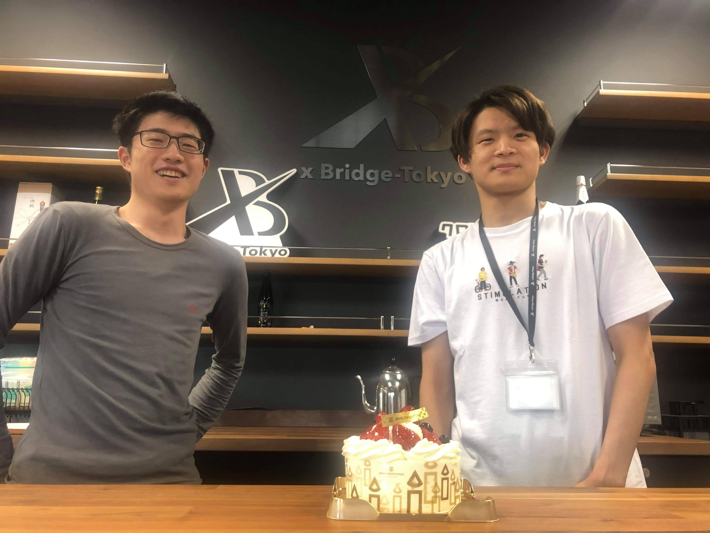

ADHDはスタートアップに向いているのか？

どうもです、白髭です。

なんだかこのテーマって、終わりがないというか、悩んでいる人が多い気がしていまして筆を取ることにしてみました。

## 自分自身を知って”optimise”する

何を隠そう私自身、極端な性格を持っています。

ご飯も食べず十数時間仕事し続ける時もあれば、何をやる気が出なくて手に付かない時もあります。
ミスをせずに的確に進められることもあれば、ミスばかりしてしまうこともあります。

自分にとって何かキーファクターなのかを的確に捉えて、環境なり自分自身なりを上手く適応させることが求められる（と、少なくとも身の回りではそういう人が多いです）。

 

例えば、自分の場合は「平常」と「リスクヘッジ」です。

### 平常

平常は、常にいつもの生活の均衡を保つこと。

常に変革が求められる業界にいる人間がいうこととは思えませんが、業界と日常は違います。
出来る限り同じルーティーンで行動し、イレギュラーなケースが発生しないようにすること。

日常が変わると、自分のテンションのバランスや、気分のコントロールがつかないことを自分がよく知っています。

### リスクヘッジ

そしてリスクヘッジ。特に自分は、理論的に動作することが乱された時、気分のコントロールがつかなくなる傾向があります。

 

小さいことですが携帯が動作しないなど。水溜りに携帯を落として動かないのは何も思わないのに、急にアプリケーションが動かなくなるのには気分が乱されます。

その、気分のバランスが乱れると仕事に全く集中できなくなってパフォーマンスが落ちます。

 

そうすると、いかに気分が乱される事態を起き得なくするかが鍵になります。気分が乱される要因は先に潰しておく、先ほどの「日常」と同じようなものです。安いハードウェアが安定しないなら、高いハードウェアでも買う。常に同じものを使う。

ネット回線が急に遅くなることがあれば高くても良い回線を使う。カフェで気分が乱されることが多いなら高くてもコワーキングスペースを契約する。

生産性を上げればその分自分の時間が生み出す収益性を高めることができます。お金で時間を買うのではなく、時間でお金を生み出すのです。

 

常に自分自身を理解するように努め、それにパッチをし、最大のパフォーマンスを維持できるようにする。これがADHDにとって、かつスタートアップの人間にとって大事だと思っています。

## スタートアップはADHDにとってベストなフィールドなのか

「スタートアップはADHDにとってベストなフィールドなのか」

なんとも言えないのも事実ですが、私なりには、向いている人と向いていない人が綺麗に分かれる。と思います。
友人の中に、ADHDの特性を最大限生かしてスタートアッパーとして最高な人もいれば、本当に向いていない人もいます。

ADHDは、私が思うに、自分が変わるのではなく環境を変えなければなりません。

 

よく「自分でよく考えろ！」とか「自分を直せ！」とか昔では聞きましたが、それはADHDには無理なんだと最近思っています。

無理じゃない、と思うかもしれないですが、無理なんです。
こればかりは理論的には説明できません。医者ならできるかもしれません。

「パッチ」をすることはできても、「根本的に修正する」ことができません。
環境が合わなければ、環境を変えるべきです。

 

スタートアップにも合う人と、合わない人がいます。ADHDにはそれが顕著に出てくると思います。

改めてですが、どちらかが悪いわけでなく、そういうものなのです。
私みたいにスタートアップのフィールドがベストで、パッチをすればどうにかなる人もいれば、この業界にいれば鬱になって倒れてしまう人もいます。

そして厄介なのが、「はじめてのスタートアップ」の場合はそれが分からない可能性が非常に高いということです。採用する立場の人間はそれを肝に銘じて、自社だけでなく、候補者のことも第一に考えるべきだと思っています。

 

ちょっと話が逸れましたね。

結論から言えば、合う人と合わない人が正反対にいると思うが、それは自分しか分からない、です。

## ADHDのスタートアップの危険性

ADHDの一部にとってスタートアップはベストなフィールドかもしれないという話をしました。

しかし、それを間に受けてはいけません。
ベストではあるが、会社にとってはベストではない可能性が拭えないからです。

ADHDにも様々な特性がありますから、これといった話はできませんが、ADHDがスタートアップを動かすにはリスクが伴います。

 

少し話を戻して、自分の話をします。

逆に物凄く気分が乗ってしまうと暴走してしまったり、乗らなすぎたら事業が進捗しません。
ちょうど良い気分を維持しなければなりません。一項で書いた通り、セルフマネージすることが一つですが、それで補えないことが多くあります。

 

この業界に何年もいて、色々な経営者をみてきましたが、共同創業者や「ナンバーツー」と呼ばれる立場の人間は大事だと思っています。

弊社でいうと @Yuki かもしれません。（多分そうです。）

 

以前私がとった一つの判断に @Yuki がしっかりと異議を伝えてくれたことがありました。
色々思うことはありますが、とても良かったと思っています。
（ちなみにその一件についてはいまだに理解していないけれども、彼がそういうならそういうことなんだろうと思っています。秘密だよ。）

自分が取った判断が正しくない、一時停止すべき時にしっかり言ってくれる人がいれば、無理に変なストッパーをかける必要がありません。

150%が行き過ぎ（暴走）としたときに、異議を伝えてくれる人がいなければ 60~80%くらいに抑えられるように日常からレベルを下げる必要があります。
しかし、その立場の人がいれば、90%~100%程度に維持ができます。この40%は非常に大きなアドバンテージになります。

 

共同創業者やメンターの存在が非常によくスタートアップで議論されますが、また違った見方で私も大事だと思っています。

## ADHD、いち社員としてのスタートアップ

自分で言うのもなんですが、ADHDは上手く使われればスタートアップで大きな成果を上げられると思っています。
素晴らしい環境のもとに常に高いパフォーマンスを出せる環境を作れば、そのアウトプットは膨大になります。

そういう人材への理解を持ち、最大のパフォーマンスを発揮できる環境（フィールド）を用意し、最大のパフォーマンスが発揮できる仕事を渡す。

これからの「働き方」はこうなっていくと思っています。

 

一説によればADHDは数割というレベルでいるとの研究もありますし、もはや「ADHD」と名札がつけれれることもなくなっていくかもしれません。

個々の性格や特性を一番発揮できるフィールドを用意することこそ、会社の成功に繋がるはずです。
これまでのようなマンパワーによる成功ではなく、個々の力を相乗的に組み合わせていく、これが求められてくるはずです。

悩みながらではありますが、そういう採用・組織戦略を取っていきたいです。

## 少し思うこと

ADHDについてつらつら書きましたが、本当にADHDには色々なレベル・色々な種類があります。自分はそうなだけで、全く違う人もいます。あくまで、自分と自分の身の回りの一例をもとに思うことを書いてみました。

読んで気分が晴れる人がいれば良いなと思いますし、もし読みかけて「それはお前だけだ！」と思えばそっと閉じてブロックして欲しいと思っています。

 

あ。最初に書いた「日常」についてもう一つ。

自分はメンタルがめちゃめちゃ弱いのですが、何かを守らなければならない立場なので、フラフラとしながらいつも頑張ってこのフィールドに立っています。

さっきも書きましたが、もし読みかけて「それはお前だけだ！」と思えばそっと閉じてブロックして欲しいです。

「お前にそんな敬意払う必要ねー！」と思う人がいたら自己防衛（ブロックなりミュートなり）するのでごめんなさい。

 

明日も変わらぬ日常を維持していくよ。そして共同創業者の君が読んでいたら、いつもありがとう。いつも豆腐メンタルで言えないけど。

 

いつも日かの写真。

