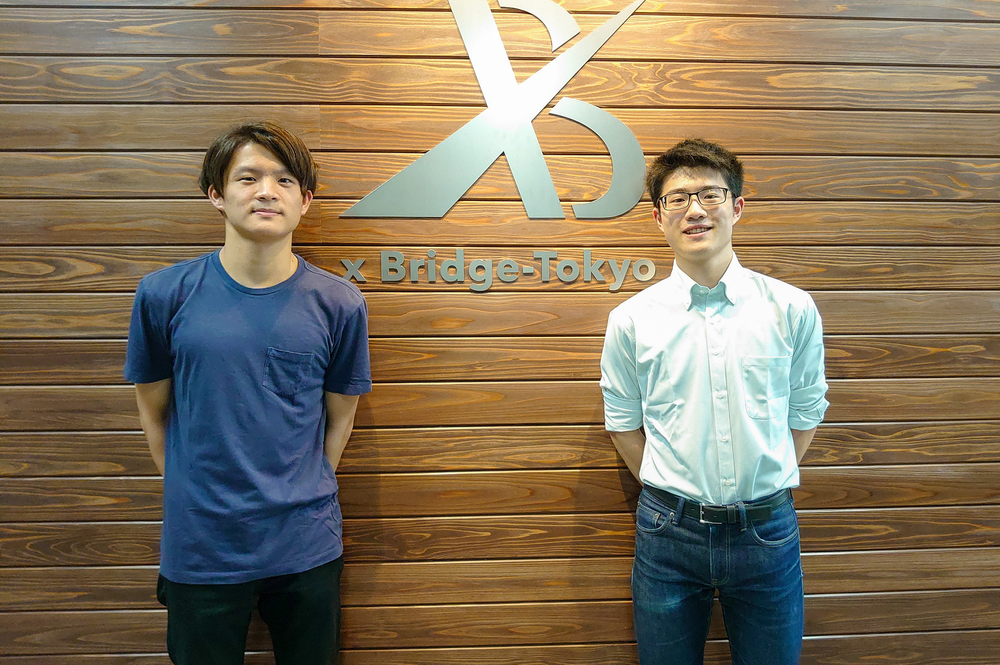

6月5日に、Yoki社で同僚の [@Yuki Kitagata](https://twitter.com/Yk_0n) と一緒に会社を設立しました。

#### やっていること

 

##### 制作業務
元々 [RUNWAY Design](https://rwy.design) で行っていたお仕事を引き継いでいます。デザイン、映像、ウェブといったクリエーティブ系のお仕事から、事業開発・マーケティング周りまでお手伝いをさせて頂いています。

##### atena
郵便をクラウド管理できるサービス [atena (アテナ)](https://atena.life) を運営しています。

 

#### どんな会社?

Yukiとも何をやろうかーって話していたのですが、お互い「面白いこと」をやりたいよねというところに尽きたので、面白いことをしたいなと。

atena もすごく面白い領域だと思っています。例えば最近、電話の領域は結構テクノロジーが入ってきていて変わりつつあるなと思うのですが、郵便は未だ「レガシー」が残り続けている領域で、競争も起きていないの領域だと思っています。この領域で戦っていくことはすごく面白くないですか？

 

#### どういうことをしていくか

個人的に自分のやることについて、2つの軸を持って考えています。

* 喜んでもらえる・影響を与える人数（or 規模）
* 社会的なインパクト

 

##### ■ 喜んでもらえる・影響を与える人数

チームの皆さんは、技術もありますし、生きていく力もありますし、結論からいえばお金は仕事をすれば稼げてしまうわけです。

だったら違うファクターで見てみたいよね、と思っています。

例えば、**これをすることで、どれくらいの人が楽しんでくれるんだろう**、というのは大事に思っています。

 

##### ■ 社会的なインパクト

これをすることで、**この世の中(社会)はどうなるんだろう？？**ということです。

例えば、これをリリースして、ここまで行ったら郵便の概念変わるだろうな！とか。カルチャー自体変えるだろうな！とか。

 

---

ざっとこういうことを考えながら生きてます。楽しいことやりたいし、楽しいことをして喜んでもらえるなら、自分も嬉しいなと思っています。

ランウェイデザインからはスケールアップして色々と仕掛けていけたらなと思っています。

新会社でも何卒、御贔屓を賜りますようお願い申しあげます。