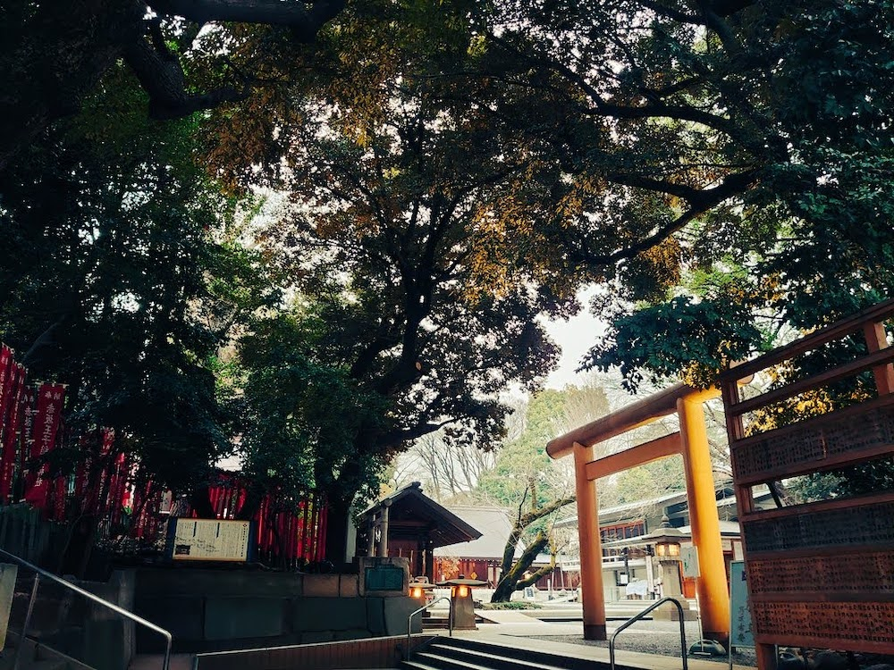
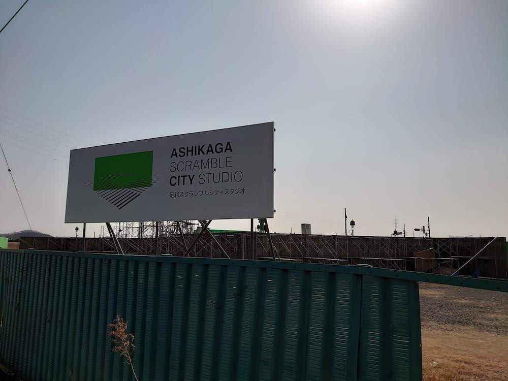

こんにちは、メンタルが安定しなさすぎる白髭です。

久しぶりに先週〜今週頭にかけて微妙なメンタルの崩し方をしていたのですが、いつものやり方でメンタルが治らなくてキツかったので少し大変でした。

そういえば昔友人が個人的取扱説明書を作っていたな〜ということを思い出して、自学のためにも纏めて見ることにしました。

ちなみに頑張ってメンタルを壊す理由までしっかり自己分析したいなと思ったのですが、そもそもそれが分かればこうなっていないわけで、相当な時間がかかりそうだったので別企画にします。

## 寝る

寝ます。とりあえず寝ます。起きてもおふとんに潜れば寝れます。

大半の場合、丸1日寝ていれば回復します。睡眠は神です。

## 推しを眺める

推しを眺めます。かわいいは正義です。

大体半日〜丸1日眺めれば回復します。

## 非生産的なことを永遠にする

永遠に YouTube をみたり、ブログを書いたりします。

座禅と同じ効果かもしれないです。

## 神社に行く

結構ガチに精神病んでた時は2週間毎日神社に通うなどしていました。

## 美味いものを食べる。

これだけで回復することはないですが、後述の旅行とかと混ぜると効果が出ます。

## 旅行に行く

一人旅は正義です。

基本的にスケジュールは決めないので、行き当たりばったりなのがいいです。できる限りノーストレスで頑張る。

行ってから観光地は調べます。

## 車

何も考えずにただただ走ります。

移動時間にラジオとかプレイリストとか飽きるまで聴き続けます。

1人でいられる狭い環境は正義です。

## 壮大なものを感じる

壮大なものを見ます。景色とか、建築物とか、技術とか。

とにかく壮大なものを見ます。

## ロケ地に行く

推しを眺めるのと被りますが、なぜか精神が統一されます。

1日に3箇所以上ロケ地を巡ると帰り道ロスになって更に精神状態が死にます。

## 太陽の陽に浴びながら仕事をする (新)

週に何回か富士河口湖町に行きたくなります。

まじで安心するんですよね…。最近富士河口湖に家を借りようか考えたくらいです。

そんなことは置いておいて、太陽の陽を浴びると精神がよくなります。

なお、太陽の日に浴びて仕事することに生産性というものを求めてはいけません。精神を早く統一するということを念じ続けます。

