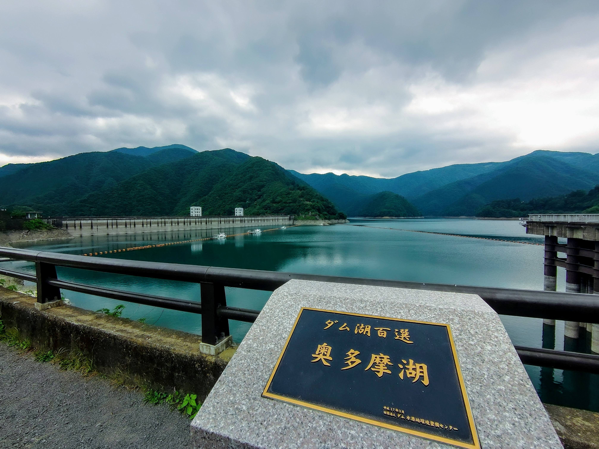

先週後半はワクチンの副作用もあって体調が厳しかったこともあるのですが、色々目先でも動きがあってつらいなーみたいな気持ちになっていました。

これは前職でも、前々職でも、なんならプライペートでも一緒なのですが、気持ちが良くない環境は非常にメンタルを壊す要因の一つで、例えばTwitterのクソリプ合戦とか見てるだけ病みを感じるくらいです。(Twitter向いてない)

色々な決断をしないといけない機会が増えてくるなかで、ワンマン社長なら「好き」「嫌い」で選べるのかもしれませんが（宗教化するのであまり好まないが）、スタートアップとしてやっている以上は会社全体における生産性とアウトプットの最大化という使命の元にこれが形成されるべきです。

そうして見た時に、今感じるこのモヤモヤというのは果たして「私情」によるものなのか、会社を憂て感じるものなのかと悩むことがあります。

 

_ちなみに話は変わるのですが共同創業者ってすごいなって思いました。私も付き合い深い某VCから投資を断られたという人に出会いましたが、彼が言ってたのは「共同創業者がいないから」ということでした。今では非常に合点が行く話です。この話はまたどこかで書きたい。_

話を戻して、こういう話を見た時に頭の中では長期的なことを考えているつもり（現状が長期的な会社に与える影響など）でも、短期的なポイントに支配されすぎていると感じます。「何故そう思うのか」「なぜその結論に至ったのか」「Plan A/Bは何か。はたまたCはあるのか」じっくりと紐をとかなければ何も生まれないのです。普段なら考えることができても、色々なもの（プライベートかもしれないし、仕事のタスクかもしれない）に圧迫された頭のメモリ容量ではそうなっていないのかもしれない。「この結論が正しいんや！」と叫べない結論は、短期的な結論だと思うのです。

 

**こういう時はリブート（再起動）してみよう。**

 

人それぞれのリブートの兆候はあるはずです。_（私の場合は深夜3時に徘徊したくなったり、とりあえず会社と反対の方向に逃げたくなったりする。鬱症状に近いな…）_

兆候を見つけたら放置せずに今すぐに再起動すべきです。そういう時のための「自由に休める会社をつくる」なのです。

 

私のリブート手段はまあまあ決まっていて、自然豊かなところに行って、風呂に浸かって、サウナに入ってぼーっとしながら想いに耽ること。次第に像が鮮明になってきて、アウトプットの焦燥に駆られます。アウトプットしたくなればなるほど、仕事がしたくなってリブート完了です。

メンタルの潰し方はそれぞれだし、直し方もそれぞれなのだが、潰さないとかは人間である以上無理なのかなーと思います。安定的に保つことに努力するのが一番なのですが不確実性の塊な職業をやっている以上、それにも限界がある気がします。そうした時のトラブルシュートは持っていて損がないのかなというのが持論です。
中には鬼メンタルな人もいますが個人的にそれは一握りだと思うし、そう振る舞うことはできるけど中身までそうであるケースはもっと少ないと思います。

自戒もこめて、ココロに素直に生きたい人生だな。

 

今日は思ったよりリブートが綺麗に決まったので、うれしい決意表明なのでした。

