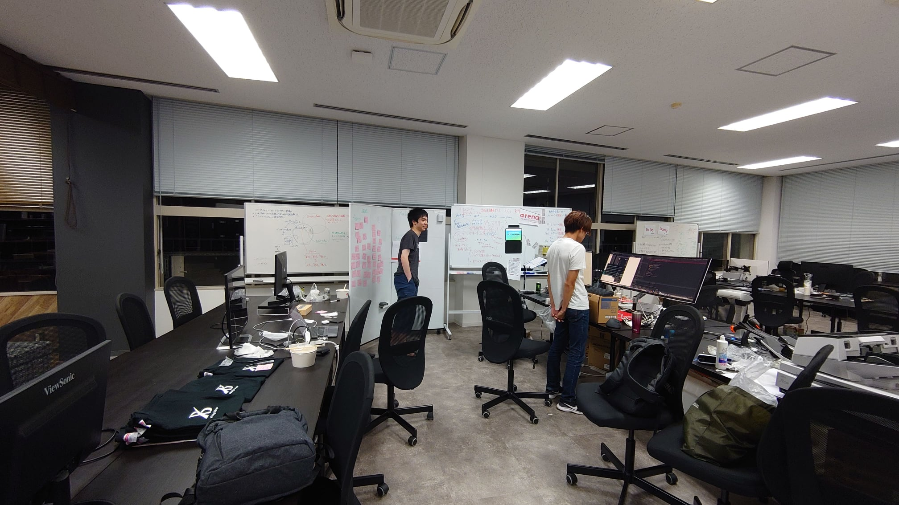

運に恵まれた2020年でした。そして、数えたら30~40回（週に1回）以上神社に詣った1年でした。

 

気付けば紅白も最後の方、荒れに荒れた2020年ももう終わりに近付いているみたいです。今年は本当に波乱万丈でしたが、運に恵まれた1年だったように思います。

 

1行目に書いた神社詣りは、今年の3月3日から始まりました。3月2日の夜からあまり良い気がしなくて（スピリチュアルですけど本当に）、赤坂・乃木神社に詣ったら、44番の凶を引き…。流石にやばいと思って厄除けをしてもらったのでした。

実にそこから色々な転換点が多く、取締役をしていた前職も上向きに動いたり、N社では atenaのリリースや資金調達、素晴らしいメンバーたちのジョインや、案件の成約をはじめ、運に恵まれた1年になりました。

 

そういう背景もあり、少し気が滅入った時や勝負どきや、大きな決断前後は神社に詣るようになりました。（2015年、この業界に初めて入った時から詣っている神田神社と、今年からは乃木神社にもよく詣っています）

 

---

 

折角なので、2020年はどんな「運」があったのか少し振り返ってみたいなーと思います。

 

**『atenaリリース』**

atenaは、今年の頭、コロナ前に「総務の効率化」という文脈で発案しキックオフしました。（町田の寿司三崎港でぼーっと同僚だった（現共同創業者） Yuki と話してた時に思いついた覚えがあります）この『発案』が後のアドバンテージに繋がりました。

（後に町田のカフェで、事業プランを話して、一緒につくって！とプッシュしたんだったっけ）

そして素晴らしいエンジニアで共同創業者のの Yuki の助けがなければ5月14日にatenaをリリースする事は叶わなかったと思います。ベストタイミングに、ベストなサービスをリリースできました。

 

**『ASCII, ITmedia, Forbesへのメディア掲載』**

リリースには、フリーでPRをお手伝いされている Monami Nagase さんと運よくBosyuで出会う事ができました。確か・・リリース数日前に連絡して、初対面なのにプレスリリース添削してもらった覚えが・・・。今思えばヤバイ人すぎる。でも、そのサポートのおかげもあって、メディア掲載に繋げる事ができました。

リリース当日にASCII、ITmediaに掲載していただき・・翌日にはForbesへ掲載していただきました。大きなメディアに掲載された事で、グッと知ってもらう機会も増え、多くの会社さん、VCさんなどからご連絡を頂くことになりました。

 

**『東京建物さんとの出会い』**

その時にお問い合わせ頂いた東京建物の 渡部 さんには、後々ここまでお世話になるとは思っていませんでしたw 「あー大企業だー、上手くいかないだろうなぁ」と思っていたのが、想定外すぎるスピード感と政治力で物事を進めていただいて驚きました。今では非常に大きなステークホルダーとなっています。（そのご縁で弊社は東京建物さんが運営する x Bridge-Tokyo に入居することになったのでした・・）

 

**『お客さまとの出会い』**

この頃から今の主要顧客となる皆さまとの出会いをいただきました。リリースして数日数週間のサービスにも関わらず、私たちを信用して、大事な郵便物を預けてくださった方々がいらっしゃった事は私たちにとってかけがえのない原動力であり強みになりました。

 

**『資金調達』**

元々は自己資本でのらりくらりやっていく予定だった atena も、↑のような経緯もあり方向性を様々話した結果、イクイティファンドを入れてスタートアップとしてやっていくことになりました。

ファーストラウンドの資金調達をほとんど労力をかけずにクローズできたのは本当に良かったです。（事業計画書なるものを作っていないことに数ヶ月後に気付くのでした）
私たちを信じてくれたVCの方々と、今ラウンドでご一緒させていただくことになったCoral Capitalの皆さんとの出会いに感謝です。

弊社はこのイクイティファンドを元に、オペレーションの増強や、プロダクトの磨き込みに取り組み始めることになりました。

 

**『メンバーとの出会い』**

資金調達のタイミングでツヨツヨ フロントエンドエンジニアの 柏 舜 と、これまたツヨツヨ デザイナーの よーた / Yota Suzuki  にジョインしてもらう事ができました。色々な奇跡が重なってジョインしていただけたのですが、この2人が居なかったらどうなっていたことか・・・。私が4月に死に物狂いで引いたatenaを、しっかりコンセプトから再構築してくれた、よーた＆ハードスケジュールで実装してくれた柏ペアにはMVPを送りたい。

 

---

 

他にも、多くの出会いがありました。atenaだけでも個人では数百名の方にご登録いただき、100社以上の法人さまにお使い頂いています。atenaのお客さま以外にも、パートナー、クライアント、多くの皆さまに様々な縁でご一緒させて頂きました。

まだまだ外に出せていない案件も多いのですが、私たちを見たこと見ないような色々な世界に連れて行って頂いています。

 

このご縁を大事に、そして地に足をつけた地道な努力が大きな奇跡（運）に繋がると信じて、2021年も邁進していきたいと考えています。

皆さま、本年は本当にありがとうございました。そして来る2021年もどうぞ宜しくお願い致します。

 

（写真は9月のリニューアルリリース直前、深夜の弊社。なんかスタートアップらしい。なお、これ以降同じ状況にはなっていないのでいい会社です？）

